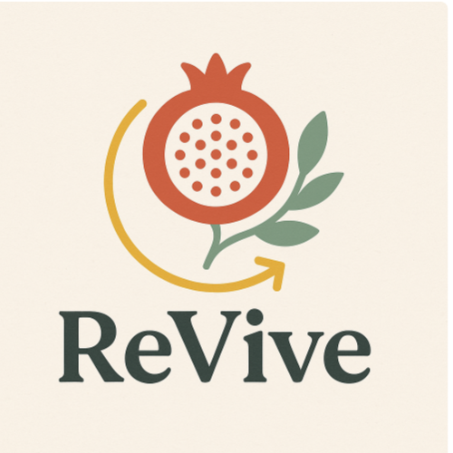

# Usability Report

#### Evaluación de usabilidad del proyecto 

### NOMBRE PROYECTO: ReVive

### Fecha: 29/05/2025

[Enlace a GITHUB del proyecto](https://github.com/DIU3-ExtremosYDuros/UX_CaseStudy)

### Realizado por:
Informe realizado por equipo DIU3-CLAVE: 

En general, nos ha parecido un poco simple, lo cual facilita la navegación. Sabemos que se trata de un prototipo en fase inicial, por lo que es comprensible que no todos los elementos sean funcionales todavía. Aun así, durante la navegación se ha observado que algunos componentes visuales dan la sensación de ser interactivos (por su diseño o posición), aunque no lo son. Esto podría generar cierta confusión en el usuario final si no se ajusta o aclara en versiones posteriores. Por lo tanto, pensamos que la página es mejorable en ese aspecto y que podría explorarse un poco más su potencial.

## 1 DESCRIPCIÓN DEL WEBSITE

El objetivo de ReVive es vender ropa artesanal y con materiales reciclados, además de formar una gran comunidad artística para todas las personas. Esta aplicación permite al usuario apuntarse a talleres, comentar en foros, añadir amigos, mandar mensajes y editar su perfil.

## 2 RESUMEN EJECUTIVO

El objetivo de este Usability Report es describir las pruebas realizadas y sus resultados para obtener los principales problemas de usabilidad. 
No hemos encontrado problemas graves aunque sí ciertas cosas que se pueden mejorar:

- La sección de Tienda no lleva a ningún sitio.
- Hay algunos botones o elementos que parecen interactivos pero no lo son (aunque entendemos que es un prototipo y no tiene que tener todas las funcionalidades).
- El Nav Bar no se mantiene fijo en la pantalla principal, sino que hay que hacer scroll hasta el final de la pantalla.
- El menú principal no es accesible desde todas las pantallas.
- En la página principal, las sección de Talleres y Foro llevan a lo mismo.

Aunque no lo consideramos como aspecto negativo, hemos echado en falta una pantalla de registro y de inicio de sesión.

## 3 METODOLOGIA 

#### Metodología de usabililidad
 Para evaluar la usabilidad hemos realizado 3 tipos de pruebas.

En primer lugar, hicimos una prueba A/B Testing, siendo el caso A nuestro proyecto "Artea" y el caso B, el proyecto "ReVive". Para ello, le hemos propuesto a los usuarios que realicen las mismas 3 tareas para cada proyecto. A continuación, tras haber interactuado con la interfaz, los usuarios completaron el cuestionario SUS. Por último, hemos realizado una prueba de Eye Tracking, en la que hemos pedido a cada usuario que realice una tarea diferente para ver cuáles son sus puntos de atención al realizarlas.

 

#### Test de usuarios: Participantes

| Usuarios      | Sexo/Edad  | Ocupación               |  Exp.TIC    | Personalidad | Plataforma | Caso
| ------------- | --------   | -----------             | ----------- | -----------  | ---------- | ----
| Gabriel       | H / 21     | Estudiante de Grado     | Alta        |  Racional    | Web        | B 
| Irene         | M / 17     | Estudiante de Instituto | Media       |  Emocional   | Web        | B 

#### Resultados obtenidos

**Resultados del cuestionario SUS**

[SUS](../3.CuestionarioSUS/cuestionarioSUS.pdf)

Para el caso A, se ha obtenido una media de 80 puntos (aceptable tipo B). Este ha recibido mejores puntuaciones en cuanto a la estética de la web, pero resulta un poco más compleja en cuanto a la navegación. Además, se ven puntuaciones más consistentes entre los usuarios.

Para el caso B, hemos obtenido una puntuación media de 75 (aceptable tipo C). Aunque supera el umbral de aceptación, se obtuvieron puntuaciones más dispares entre los dos usuarios. 

**Resultados del Eye Tracking**

[EyeTracking](../5.EyeTracking/EyeTracking.pdf)

## 4 CONCLUSIONES 

Los resultados de las pruebas mencionadas anteriormente, nos indican que la usabilidad del prototipo es bastante buena, ya que tiene una navegación sencilla y los usuarios han conseguido realizar con éxitos las tareas propuestas. Sin embargo, el cuestionario SUS nos indica que hay un margen de mejora. 

#### Incidencias

* Como hemos comentado en el apartado correspondiente, al realizar el A/B Testing, hemos tenido un problema en la segunda prueba. El usuario no podía cambiar de pantalla y por lo tanto, no consiguió su objetivo. No sabemos si es problema de la herramienta Maze, ya que hemos realizado ambos test exactamente igual y el otro no nos dió ningún problema.
* Al realizar el eye tracking, nos hubiera gustado pasarle la url del prototipo de figma pero nos daba error. Así que tuvimos que pasarle las imágenes de los frames, condicionando así a la navegación del usuario.

#### Valoración 

* Navegación sencilla e intuitiva.
* El diseño genera una impresión de calidad y profesionalidad, similar a la experiencia ofrecida por una aplicación real.

#### Recomendaciones y propuesta de mejoras: 

* Añadir una pantalla de registro e inicio de sesión.
* Dejar el Nav Bar fijo y que aparezca en todas las pantallas.
* Dejar claro aquellos elementos que contribuyen a la navegación.

#### Valoración de la prueba de usabilidad (self-assesment)

Gracias a este estudio de usabilidad nos hemos dado cuenta de algunos fallos. Por ejemplo, gracias al Eye Tracking hemos visto que el menu inferior no está fijo.
Gracias al A/B Testing nos hemos dado cuenta de que hay algunas pantallas desde las que no se puede volver a la página principal. Finalmente, el cuestionario SUS nos ha ayudado a ver algunas inconsistencias en la navegabilidad (botones sin funcionalidad que han confundido a los usuarios).
