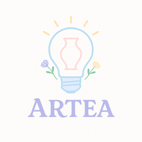
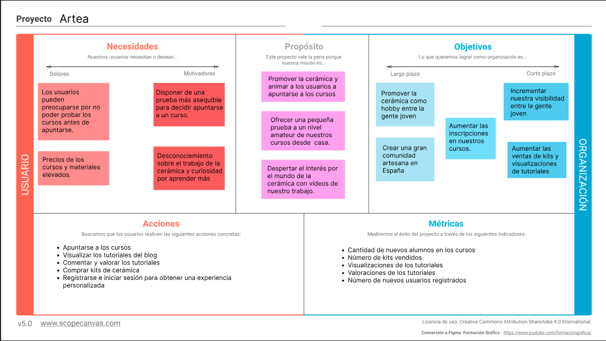
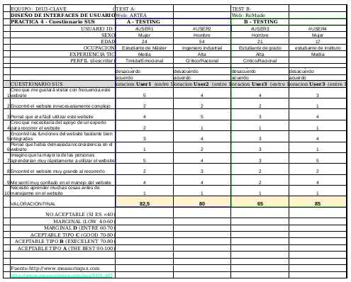
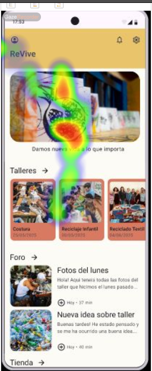
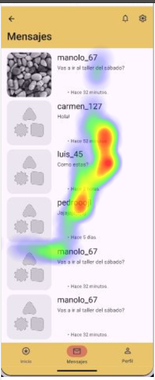
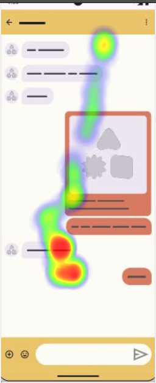

# DIU25
Prácticas Diseño Interfaces de Usuario (Tema: Reciclaje y artesanía (handcraft) ) 

[Guiones de prácticas](GuionesPracticas/)

**Grupo:** DIU3_CLAVE.  **Curso:** 2024/25 

**Actualizado:** 1/04/2025

**Proyecto:** ARTEA

**Descripción:**

La idea de nuestro proyecto es añadir una sección para que los usuarios puedan aprender el arte de la cerámica gracias a kits y tutoriales que estarán disponibles en la página. El objetivo principal es dar una pequeña prueba que pueden realizar desde casa para que los usuarios decidan si les gusta. Y en ese caso, animarles a que se apunten a los cursos y talleres.

**Logotipo:**

**Miembros:**
 * :bust_in_silhouette:  Clara Ruo García Segovia     :octocat:     
 * :bust_in_silhouette:  Eva Valcárcel López     :octocat:

**Demo:**
Aquí os dejamos el [link](https://www.figma.com/proto/0Qb79EL8omNhtkVEbWiPW6/Wireframes?node-id=383-3982&t=UD9xkAV7ArfxcaYF-0&scaling=min-zoom&content-scaling=fixed&page-id=60%3A18&starting-point-node-id=383%3A3982&show-proto-sidebar=1) para que echéis un vistazo. Recomendamos poner el modo de pantalla completa.

> [!NOTE]
> En algunas pantallas hemos simulado la acción de volver hacia atrás con una animación de deslizar la pantalla hacia el lateral.
> Al clicar fuera del frame se indican los elementos interactuables. Sin embargo, hay algunos que no se indican, por ejemplo:
> - Las páginas tienen scroll vertical.
> - El mapa de la sección contacto se amplia si mantienes pulsado.
> - En la vista de un tutorial, en tutoriales recomendados hay scroll horizontal
> - En los comentarios, se puede interactuar con las estrellas y los pulgares.

----- 

# Proceso de Diseño 

 

## Paso 1. UX User & Desk Research & Analisis 

### 1.a User Reseach Plan 
-----
El proyecto seleccionado para la investigación es la página web de “Kerarqueo Artesanía”, un centro artesanal de cerámica dedicado al Patrimonio y reproducciones arqueológicas. Aunque no contamos con experiencia previa en cerámica, estamos familiarizadas con el mundo de la artesanía a través de otras disciplinas como el crochet, lo que nos permite acercarnos al contexto desde una perspectiva de interés y valoración por las técnicas tradicionales.

El objetivo principal de la investigación es, a parte de mejorar la experiencia del usuario al utilizar la plataforma,  incrementar las ventas de productos e inscripciones a los cursos ofertados. Además, se busca aumentar la visibilidad de la marca y causar mayor impacto en un público más jóven, contribuyendo así en  la preservación de las tradiciones artesanales y arqueológicas. 

La estrategia que seguiremos estará basada en realizar análisis comparativos con plataformas similares, la creación de personas ficticias que nos ayuden a entender mejor al público objetivo, así como user journey maps que nos ayuden a mejorar la interacción con nuestra página. Finalmente, se realizará un usability review que identifique problemas de usabilidad.

Enlace al pdf: [User Research Plan](./P1/1.UserResearchPlan/User_Reasearch_Plan.pdf)

### 1.b Competitive Analysis
-----
Para el análisis competitivo hemos elegido 2 páginas relacionadas también con la venta de artesanías:

* Pepa Moreno Cerámica: Taller de cerámica artesanal y sostenible en Baeza. Además, ofrecen talleres y cursos.
* Alfarería Núñez: Taller de cerámica artesanal realizada a mano y venta online. Además, cuenta con un blog muy interesante. 

Hemos elegido estas páginas porque ofrecen productos artesanales y servicios similares a Kerarqueo Granada. Cada una de ellas, presenta elementos que se podrían haber aprovechado mejor en las demás. Por ejemplo, el blog de Alfarería Núñez destaca sobre los de Pepa Moreno o Kerarqueo; mientras que la estética de Pepa Moreno resulta más atractiva que la de las otras dos.
Por ello, hemos pensado que realizar una comparativa con estas 2 páginas podría aportar información relevante a nuestra investigación.

Para comparar las 3 páginas hemos valorado de 0 a 3 estrellas los siguientes criterios:
* Actualizaciones frecuentes: comprobar si la página está actualizada en cuanto a los talleres que ofertan como en las publicaciones de los blogs.
* Estrategia de expansión: hemos valorado que a parte de vender artesanías, también ofrezcan cursos y tengan un blog atractivo.
* Estrategia de marketing: si tienen enlaces visibles a sus redes sociales y que funcionen correctamente
* Rendimiento de la web: hemos valorado que tarde poco en cargar las páginas
* Seguridad y protección de datos: que dispongan de aviso legal, política de privacidad y pago seguro; y que sean visibles.
* Soporte multilingüe: si se puede cambiar el idioma de la página
* Opciones de filtrado y búsqueda: si se pueden filtrar los artículos según la categoría, precio, más recientes… o directamente hacer una búsqueda concreta.
* Contacto: si hay información de contacto visible como el teléfono, correo electrónico o incluso un formulario para enviar un mensaje. También hemos valorado que tenga mapa útil.
* Cuenta de usuario: hemos valorado si hay opción de que los usuarios se creen una cuenta y la facilidad para hacerlo.
* Diseño intuitivo: si la página es fácil de usar, si está bien estructurada y los botones clicables son distinguibles.
* Retroalimentación: hemos valorado que la página ofrezca mensajes de confirmación, ya sea cuando se incluye un producto en el carrito o al realizar un pago, además de si hay opción de valoraciones para los usuarios.
* Inscripción a cursos: si ofrecen cursos activos y hay facilidades en la página para apuntarse.

Enlace al pdf: [Competitor Analysis](./P1/2.CompetitorAnalysis/Competitor%20Analysis%20[DIU23].pdf)

### 1.c Personas
Para esta práctica hemos elegido dos perfiles de personas diferentes y con distintos objetivos. Por un lado, nos encontramos con Julio, un hombre mexicano de mediana edad que quiere comprar una artesanía arqueológica para añadir a su colección. Por otro lado, Raquel es una estudiante de medicina que busca apuntarse a clases de cerámica para desconectar del estrés de la universidad.

 

### 1.d User Journey Map
Hemos elegido estos dos casos de estudio para valorar la experiencia del usuario en las dos tareas más comunes que se pueden hacer en la página: comprar un artículo y apuntarse a un curso. Además, queríamos reflejar lo poco intuitivo que es realizarlas y las dificultades que hemos encontrado. Lo más destacable es que no queda muy claro cómo añadir artículos al carrito y no se sabe cómo ni cuándo se recibirá respuesta de las solicitudes enviadas.

 

### 1.e Usability Review
- Enlace al documento: [Usability_review](./P1/5.UsabilityReview/Usability-review.pdf)
-  Valoración numérica obtenida: 61 - Moderate
- Comentario sobre la revisión:  La puntuación obtenida nos parece adecuada ya que consideramos que la página es mejorable puesto que el proceso de compra no es nada intuitivo y el menú es inconsistente. Sin embargo, cabe destacar la variedad de servicios que ofrece, las facilidades para contactar con ellos y una respuesta rápida. Además, a la página no le faltan muchos elementos ya que cuenta con filtros, buscador, formularios bien estructurados...

### 1.f Briefing final
Como se indicó inicialmente en el Research plan, nuestro objetivo era aumentar la
visibilidad entre un público más jóven y mejorar la experiencia de usuario.

Para ello, iniciamos haciendo un análisis de competidores con otras dos páginas
similares. Concluimos que los competidores presentaban mejor estética, actualizaban
periódicamente sus servicios, ofrecían cursos en fechas actuales y publicaciones recientes
en sus blogs; contrastando con nuestra página.

Después, valoramos la experiencia de dos perfiles con intereses distintos en el uso de la
página. Julio, un coleccionista de artesanía interesado en apoyar a pequeños artistas
locales, quería comprar unas artesanías online pero se encontró con un sistema de compra
muy confuso. Raquel, una estudiante que buscaba apuntarse a cursos de cerámica para
desconectar de la universidad, se encontró con un menú inconsistente que le complicó
encontrar desde dónde apuntarse a los cursos ofrecidos y con un método de inscripción
poco claro.

Finalizamos con una revisión de usabilidad, donde valoramos algunos aspectos técnicos
relacionados con las funcionalidades y navegación, entre otros. Concluimos que, aunque la
página cuente con bastantes elementos y herramientas, algunos aspectos como la
inconsistencia del menú dificultaron la experiencia.

En conclusión, la página tiene potencial, pero es necesario mejorar la estética, corregir
botones defectuosos, reorganizar el menú y simplificar el proceso de compra para hacerlo
más intuitivo.

* Enlace al pdf: [Briefing final](./P1/6.Briefing/Briefing.pdf)
 

## Paso 2. UX Design  

### 2.a Reframing / IDEACION: Feedback Capture Grid / EMpathy map 
Hemos realizado un Feedback Capture Grid sobre la página web de "Kerarqueo". En él, hemos sintetizado los aspectos más relevantes desde nuestra experiencia al analizar la página en la práctica 1. Esto nos ayudará a plantear mejor el diseño de nuestra plataforma.

  

### 2.b ScopeCanvas
Queremos acercar el mundo de la cerámica a más personas y contribuir a preservar esta tradición. Para ello, proponemos una pequeña prueba que se puede realizar desde casa. Crearemos kits con todos los materiales necesarios para llevar a cabo proyectos sencillos de cerámica, guiados por tutoriales disponibles en nuestra web. A través de esta prueba, los usuarios podrán explorar esta actividad creativa y así decidir si dar el siguiente paso: apuntarse a nuestros talleres y cursos, donde trabajarán con herramientas y materiales profesionales para llevar sus proyectos a otro nivel.

### 2.b User Flow (task) analysis 
* User Flows
  
Hemos realizado dos user flows que muestran los pasos que seguirían los usuarios por nuestra página en dos situaciones. El primero, cuando quieren adentrarse en el mundo de la artesanía para aprender (en nuestra sección "ARTEA"), ya sea para comprar algún kit o para visualizar un tutorial. El segundo representa el flujo del usuario para iniciar sesión o registrarse en la plataforma, lo cual es necesario para realizar ciertas acciones como dejar un comentario en los tutoriales o hacer una compra.

* Task Analysis

Acción | Usuario no registrado | Usuario registrado | Administrador   
| ------------- | ------------- | ------------- | -------------
  Iniciar sesión  | - | Alta | Alta
  Cerrar sesión | - | Media | Alta
  Registrarse | Alta | - | -
  Buscar kit | Alta | Alta | Alta
  Buscar tutorial | Alta | Alta | Alta
  Comprar | - | Alta | Baja
  Ver tutorial | Alta | Alta | Baja
  Inscribirse a un curso | - | Alta | Baja
  Dejar un comentario | - | Media | Baja
  Editar perfil | - | Alta | Alta 
  Añadir al carrito | - | Alta | Baja
  Ir al carrito | - | Alta | Baja
  Subir tutorial | - | - | Alta
  Subir kit | - | - | Alta
  Seleccionar componentes del kit | - | Alta | Baja
  Cancelar compra | - | Media | Baja

> [!NOTE]
> Hemos valorado las tareas según la prioridad o relevancia para los distintos tipos de usuario. Estas serían Alta/Media/Baja/- (no tiene acceso)

* Enlace al pdf: [TaskAnalysis](./P2/3.UserFlows/TaskAnalysis.pdf)
### 2.c IA: Sitemap + Labelling 

* Sitemap
  

* Labelling

| **Término**                  | **Significado**                                                                                                                                     |
|---------------------------|-----------------------------------------------------------------------------------------------------------------------------------------------------|
| HomePage                  | Página principal que da acceso al resto de funcionalidades de la web                                                                               |
| Mi cuenta                 | Página donde se muestra todo lo relacionado con la cuenta de usuario                                                                               |
| Carrito                   | Página donde encuentras la lista de productos que quieres comprar                                                                                  |
| ARTEA                     | Sección donde se encuentra todo lo relacionado con aprender el arte de la cerámica                                                                |
| Sobre nosotros            | Sección donde se presenta información general sobre la empresa y sus integrantes                                                                  |
| Catálogo                  | Sección donde se encuentra la selección de productos ofrecidos para la venta                                                                      |
| Blog                      | Sección donde suben post sobre los eventos de la empresa                                                                                           |
| Iniciar sesión            | Página de acceso para usuarios registrados. Podrá incluir sus credenciales para acceder a funciones avanzadas                                     |
| Registrarse               | Página de acceso para usuarios no registrados. Aquí pueden crearse una cuenta de usuario y disponer de más acciones como comentar o comprar       |
| Mi Perfil                 | Sección donde el usuario puede ver los datos compartidos con Kerarqueo Granada                                                                    |
| Editar perfil             | Permite editar los datos del perfil del usuario                                                                                                    |
| Cerrar sesión             | Permite cerrar la sesión a un usuario ya registrado con sesión iniciada                                                                            |
| Realizar compra           | Permite acceder al pago de los productos seleccionados en el carrito y un formulario para rellenar la información de envío                        |
| Cancelar compra           | Permite cancelar el proceso de compra                                                                                                              |
| ¿Qué es ARTEA?            | Página donde se explica con más detalle qué es la nueva sección ARTEA                                                                             |
| Cursos                    | Página con los cursos y talleres disponibles                                                                                                       |
| Inscribirse               | Permite inscribirse a un curso de la selección                                                                                                     |
| Kits                      | Página con el catálogo de kits ofrecidos                                                                                                           |
| Selección                 | Permite seleccionar los componentes de un kit que quieres comprar                                                                                 |
| Tutoriales                | Página con el catálogo de tutoriales disponibles                                                                                                   |
| Buscar                    | Permite buscar un tutorial o kit concretos                                                                                                         |
| Comentar                  | Permite incluir un comentario en uno de los tutoriales, así como valorar el tutorial (dar me gusta o no me gusta) e interaccionar con otros usuarios |
| ¿Quiénes somos?           | Sección con información acerca de la empresa y sus integrantes                                                                                     |
| Contacto                  | Sección con información de contacto, correo, teléfono, étc                                                                                         |
| Preguntas frecuentes      | Sección con respuestas a preguntas frecuentes de usuarios                                                                                          |
| Términos y condiciones    | Página con los términos y condiciones, donde se incluyen varias políticas referentes al envío, las reseñas, etc                                   |
| Todos los productos       | Página con el catálogo de todos los productos que están a la venta, ya sean artesanías o materiales                                               |
| Reproducciones arqueológicas | Catálogo específico para réplicas de piezas arqueológicas de distintos períodos históricos como la Prehistoria, Romana, Griega…               |
| Regalos institucionales   | Sección con productos personalizados que promueven la identidad cultural de los municipios                                                         |

* Enlace al pdf: [Labelling](./P2/4.Sitemap/Labelling.pdf) 

### 2.d Wireframes
* Bocetos a mano: [Bocetos](./P2/5.Wireframes/Bocetos.pdf) 

* Lo-FI Wireframes: los diseños de baja/media fidelidad los hemos hecho con figma. Tenemos las siguientes vistas.

   1. Vista general de tutoriales y kits (es la misma) y su versión con el menú desplegado.
      

  2. Vista general de tutoriales y kits en versión para tablet y móvil.
      

  3. Vista del menú desplegable y submenús de la versión para móviles.
      

  4. Vista de un tutorial y de un kit concretos.
      

  5. Vista de inicio de sesión y de registro.
      

  6. Vista de la sección "¿Qué es ARTEA?"
      

### 2.e Conclusiones
Esta práctica nos ha ayudado a comprender mejor los puntos críticos de la página web de Kerarqueo a través del Feedback Capture Grid. Gracias a ello, hemos podido reestructurar y rediseñar la página, para darle otro enfoque. Nuestra intención es darle más énfasis a la parte de aprender el arte de la cerámica y no solo a comprar. Para ello, se nos ocurrió añadir una nueva sección llamada ARTEA, la cual engloba la venta de kits, la inscripción a cursos y la visualización de tutoriales. Una vez que tuvimos clara la propuesta de valor, empezamos haciendo unos bocetos a mano, que posteriormente pasamos a figma, obteniendo un prototipo de baja fidelidad.

## Paso 3. Mi UX-Case Study (diseño)

### 3.a Moodboard
**Moodboard:**

**Logo:**

### 3.b Landing Page

### 3.c Guidelines

Para hacer los componentes hemos utilizado los plugins de Figma “Material 3 Design Kit” y el de “IOS 18”, aunque también hemos creado nuestros propios componentes. Además, para mantener la coherencia hemos usado el color morado para los botones, y hemos seguido un código de colores durante toda la aplicación (rosa para los cursos y el blog, azul para los kits y sobre nosotros; y verde para los tutoriales y el catálogo).
Tenemos algunos elementos de navegación que están fijos (en el header): el logo de Artea que te lleva a la página de inicio, el menú, el perfil y el carrito. 

Vamos a usar lo siguiente:

**- Onboarding:** 
hemos hecho una pequeña animación al inicio de la aplicación, que simula una bombilla encendiéndose y lleva a una página en la que se da la bienvenida al usuario, explica un poco el propósito de la aplicación y hay un botón que conduce a la página de inicio de sesión.

**- Menú:** 
hemos realizado un menú hamburguesa usando un overlay con las distintas secciones de nuestra página, también diferenciadas por colores.

**- Hero image + Carousel:** 
En la página principal hay un carousel que enseña imágenes de cursos anteriores. La imagen principal es de mayor tamaño y se van pasando las imágenes automáticamente.

**- Search:** 
barras de búsqueda para buscar un curso, kit, tutorial, producto o publicación del blog por su nombre.

**- Cards items:** 
para representar una vista general de los distintos servicios que ofrecemos. En cada vista hay una lista con 5 cards que se pueden ver realizando scroll vertical.

**- Item details + actions:** 
cada curso tiene un título y foto, descripción, botón para apuntarse y una sección de comentarios, es decir, tiene una vista detallada; al igual que los kits, tutoriales, productos del catálogo y posts del blog.

**- Form input:** 
formularios para registrarse, iniciar sesión y editar los datos del usuario. Además, al clicar en cualquier campo del formulario aparece el teclado.

**- Shopping cart:** 
página para comprar cursos, kits o productos.

**- About:** 
pequeña descripción de quiénes somos, preguntas frecuentes e información de contacto.

**- Filtros:** 
filtros para ordenar por distintas categorías.

Todo esto se encuentra más detallado y acompañado de imágenes en: [Guidelines](./P3/3.Guidelines/Guidelines.pdf) 

### 3.d Mockup
Nuestro Mockup comienza con una pequeña animación Onboarding que da la bienvenida al usuario. Seguidamente, hay un formulario para registro o inicio de sesión.Una vez iniciado sesión, aparece la página de inicio. El menú de navegación en la parte superior permite cambiar entre las principales secciones.
Aquí os dejamos el [link](https://www.figma.com/proto/0Qb79EL8omNhtkVEbWiPW6/Wireframes?node-id=383-3982&t=UD9xkAV7ArfxcaYF-0&scaling=min-zoom&content-scaling=fixed&page-id=60%3A18&starting-point-node-id=383%3A3982&show-proto-sidebar=1) para que echéis un vistazo. Recomendamos poner el modo de pantalla completa.

> [!NOTE]
> En algunas pantallas hemos simulado la acción de volver hacia atrás con una animación de deslizar la pantalla hacia el lateral.
> Al clicar fuera del frame se indican los elementos interactuables. Sin embargo, hay algunos que no se indican, por ejemplo:
> - Las páginas tienen scroll vertical.
> - El mapa de la sección contacto se amplia si mantienes pulsado.
> - En la vista de un tutorial, en tutoriales recomendados hay scroll horizontal
> - En los comentarios, se puede interactuar con las estrellas y los pulgares.

### 3.e ¿My UX-Case Study?
 
-----
Puedes ver nuestro UX-Case Study completo [aquí](https://github.com/DIU3-CLAVE/UX_CaseStudy)

 

## Paso 4. Pruebas de Evaluación 

### 4.a Reclutamiento de usuarios 

El caso asignado es el proyecto "[ReVive](https://github.com/DIU3-ExtremosYDuros/UX_CaseStudy)". Se trata de una aplicación en la que se vende ropa artesanal y se realizan talleres multitudinarios. Además, está enfocada en crear una gran comunidad artística donde tenga cabida todo tipo de personas. Para ello, cuenta con un foro donde se pueden comunicar y puclicar fotos.

| Usuarios      | Sexo/Edad  | Ocupación               |  Exp.TIC    | Personalidad | Plataforma | Caso
| ------------- | --------   | -----------             | ----------- | -----------  | ---------- | ----
| Celeste       | M / 24     | Estudiante de Máster    | Media       |  Emocional   | Web        | A 
| Cipriano      | H / 54     | Ingeniero industrial    | Alta        |  Racional    | Web        | A 
| Gabriel       | H / 21     | Estudiante de Grado     | Alta        |  Racional    | Web        | B 
| Irene         | M / 17     | Estudiante de Instituto | Media       |  Emocional   | Web        | B 

### 4.b Diseño de las pruebas 
Para evaluar la usabilidad de los dos casos realizaremos 3 tipos de pruebas.

En primer lugar, haremos una prueba A/B Testing, siendo el caso A nuestro proyecto "Artea" y el caso B, el proyecto "ReVive". Este tipo de prueba se centra en ver si se cumplen ciertos objetivos. Para ello, le hemos propuesto a los usuarios que realicen las mismas 3 tareas para cada proyecto.  

A continuación, tras haber interactuado con cada una de las interfaces, los usuarios completaron el cuestionario SUS. Este consiste en 10 preguntas evaluadas del 1 (en desacuerdo) al 5 (totalmente de acuerdo).  Se considera que los resultados son aceptables a partir de una puntuación de 70.

Por último, hemos realizado una prueba de Eye Tracking para averiguar qué partes reciben más atención y si los usuarios se detienen a leer o realizan un escaneo rápido. Esta prueba solo la hemos hecho para el caso B, pidiendo a cada usuario que realice una tarea diferente.

### 4.c Cuestionario SUS

**Valoración Personal**

- Cipriano (caso A): "La página me ha parecido muy intuitiva y fácil de usar."
- Celeste (caso A): "La aplicación tiene un diseño muy bonito, aunque la navegación es algo compleja."
- Gabriel (caso B): "El diseño es sencillo aunque a veces puede ser poco intuitivo."
- Irene (caso B): "La página es fácil de usar."

**Resultados**

Para el caso A, se ha obtenido una media de 80 puntos (aceptable tipo B). Este ha recibido mejores puntuaciones en cuanto a la estética de la web, pero resulta un poco más compleja en cuanto a la navegación. Además, se ven puntuaciones más consistentes entre los usuarios.

Para el caso B, hemos obtenido una puntuación media de 75 (aceptable tipo C). Aunque supera el umbral de aceptación, se obtuvieron puntuaciones más dispares entre los dos usuarios. En el caso de Gabriel, al intentar añadir a un usuario como amigo en la aplicación, una de las tareas a realizar en la prueba de Eye Tracking, le pareció poco intuitivo tener que clicar en la foto de perfil del usuario que escribió el post, ya que esperaba algún botón o alguna marca visual que resalte la funcionalidad.

**Enlace al pdf**: [SUS](P4/3.CuestionarioSUS/cuestionarioSUS.pdf)

### 4.d A/B Testing

Hemos realizado 3 pruebas aplicadas a cada prototipo.

- Prueba 1: en esta prueba el usuario tiene que conseguir editar los datos de su perfil. Para ello, hemos valorado que el usuario siga un camino específico.
- Prueba 2: en esta prueba el usuario debe encontrar la sección de comentarios de los cursos (en el caso A) o talleres (en el caso B). Esta vez, hemos valorado que el usuario llegue a la pantalla objetivo, sin importar el camino seguido.
- Prueba 3: en esta última prueba hemos dejado al usuario navegar libremente por las interfaces. En este caso, valoramos el tiempo medio que han permanecido en la página antes de finalizar el test. Interpretando un mayor tiempo de estancia en esta prueba como un indicio de mayor interés.

| Prueba      | Métrica           | Caso A    |  Caso B    
| ------------| --------          | --------- | ----------- 
| Prueba 1    | Camino correcto   | No        | Sí       
| Prueba 2    | Pantalla objetivo | Sí        | Sí*        
| Prueba 3    | Tiempo medio      | 70 s      | 25.5 s       

**Comentarios**

Gracias a la prueba 1 aplicada al caso A, nos hemos dado cuenta de un problema que tenía nuestro prototipo. Como hemos rehusado componentes, es posible saltarse la pantalla de Log-In inicial y entrar directamente en el perfil, carrito o menú principal, sin haber iniciado sesión previamente. La idea de esta prueba era que el usuario iniciara sesión, y desde la homepage accediera a su perfil y lo editara. Sin embargo, desde la pantalla de onboarding han accedido al perfil. En el caso B sí han seguido la ruta adecuada.

En la segunda prueba, en ambos casos se ha llegado a la pantalla objetivo pero hemos tenido un problema en el caso B. No sabemos si ha sido por un error del prototipo o de Maze, pero no dejaba cambiar de pantalla. Por este motivo, cada usuario ha tenido que repetir la prueba en otro dispositivo, lo que explica por qué en los resultados figura que han realizado la prueba cuatro personas.

En la tercera prueba, hemos dejado que el usuario navegara libremente, aunque al final hemos aportado una pequeña asistencia para mostrarles interacciones que habían pasado por alto. Podemos observar que han permanecido más tiempo en el caso A.

>[!NOTE]
>Cabe resaltar que al haber estado acompañando a los usuarios podemos afirmar que el tiempo que han permanecido en las páginas no se ha debido a desorientación o >problemas con la nevagación.

Tras estos resultados, podemos concluir que el caso B es más usable, ya que consiguió superar la prueba 1 con éxito. Sin embargo, si se solucionara el problema del caso A, al haber mostrado los usuarios más interés en la prueba 3, este sería más usable.

**Enlaces a los resultados**

[Caso A](P4/4.AB_Testing/Maze-Report_CLAVE.pdf)

[Caso B](P4/4.AB_Testing/Maze-Report_ReVive.pdf)

**Solución propuesta**

Hemos solucionado el problema encontrado en la prueba 1. Este es el [enlace](https://www.figma.com/proto/0Qb79EL8omNhtkVEbWiPW6/Wireframes?node-id=478-6538&t=YZS9xN9gUfQ7LGxk-0&scaling=contain&content-scaling=fixed&page-id=478%3A6476&starting-point-node-id=478%3A6549) al prototipo arreglado.

### 4.e Aplicación del método Eye Tracking 

Hemos utilizado la herramienta Gaze Recorder para analizar la usabilidad del caso B (ReVive). Para ello, hemos elegido a dos usuarios que no habían visto antes la aplicación y le hemos pedido a cada uno que realice una tarea.

**Tarea 1:** con esta tarea queremos comprobar si el usuario es capaz de añadir a otro usuario como amigo en la aplicación. Además, también nos sirve para saber qué elementos destacan más para el usuario. 

Como podemos observar, lo más llamativo para el usuario son las imágenes. También vemos que se ha centrado en los títulos, lo cual es necesario para la tarea que se le había encomendado. 

**Tarea 2:** esta tarea consiste en ver si el usuario es capaz de enviar un mensaje y qué es lo que más le llama la atención de la página para conseguirlo. 

Como podemos observar, el usuario ha mirado más el texto, aunque en la página principal le ha llamado más la atención las imágenes.

### 4.f Usability Report de B

# Usability Report

#### Evaluación de usabilidad del proyecto 

### NOMBRE PROYECTO: ReVive

### Fecha: 29/05/2025

[Enlace a GITHUB del proyecto](https://github.com/DIU3-ExtremosYDuros/UX_CaseStudy)

### Realizado por:
Informe realizado por equipo DIU3-CLAVE: 

En general, nos ha parecido un poco simple, lo cual facilita la navegación. Sabemos que se trata de un prototipo en fase inicial, por lo que es comprensible que no todos los elementos sean funcionales todavía. Aun así, durante la navegación se ha observado que algunos componentes visuales dan la sensación de ser interactivos (por su diseño o posición), aunque no lo son. Esto podría generar cierta confusión en el usuario final si no se ajusta o aclara en versiones posteriores. Por lo tanto, pensamos que la página es mejorable en ese aspecto y que podría explorarse un poco más su potencial.

## 1 DESCRIPCIÓN DEL WEBSITE

El objetivo de ReVive es vender ropa artesanal y con materiales reciclados, además de formar una gran comunidad artística para todas las personas. Esta aplicación permite al usuario apuntarse a talleres, comentar en foros, añadir amigos, mandar mensajes y editar su perfil.

## 2 RESUMEN EJECUTIVO

El objetivo de este Usability Report es describir las pruebas realizadas y sus resultados para obtener los principales problemas de usabilidad. 
No hemos encontrado problemas graves aunque sí ciertas cosas que se pueden mejorar:

- La sección de Tienda no lleva a ningún sitio.
- Hay algunos botones o elementos que parecen interactivos pero no lo son (aunque entendemos que es un prototipo y no tiene que tener todas las funcionalidades).
- El Nav Bar no se mantiene fijo en la pantalla principal, sino que hay que hacer scroll hasta el final de la pantalla.
- El menú principal no es accesible desde todas las pantallas.
- En la página principal, las sección de Talleres y Foro llevan a lo mismo.

Aunque no lo consideramos como aspecto negativo, hemos echado en falta una pantalla de registro y de inicio de sesión.

## 3 METODOLOGIA 

#### Metodología de usabililidad
 Para evaluar la usabilidad hemos realizado 3 tipos de pruebas.

En primer lugar, hicimos una prueba A/B Testing, siendo el caso A nuestro proyecto "Artea" y el caso B, el proyecto "ReVive". Para ello, le hemos propuesto a los usuarios que realicen las mismas 3 tareas para cada proyecto. A continuación, tras haber interactuado con la interfaz, los usuarios completaron el cuestionario SUS. Por último, hemos realizado una prueba de Eye Tracking, en la que hemos pedido a cada usuario que realice una tarea diferente para ver cuáles son sus puntos de atención al realizarlas.

 

#### Test de usuarios: Participantes

| Usuarios      | Sexo/Edad  | Ocupación               |  Exp.TIC    | Personalidad | Plataforma | Caso
| ------------- | --------   | -----------             | ----------- | -----------  | ---------- | ----
| Gabriel       | H / 21     | Estudiante de Grado     | Alta        |  Racional    | Web        | B 
| Irene         | M / 17     | Estudiante de Instituto | Media       |  Emocional   | Web        | B 

#### Resultados obtenidos

**Resultados del cuestionario SUS**

[SUS](P4/3.CuestionarioSUS/cuestionarioSUS.pdf)

Para el caso A, se ha obtenido una media de 80 puntos (aceptable tipo B). Este ha recibido mejores puntuaciones en cuanto a la estética de la web, pero resulta un poco más compleja en cuanto a la navegación. Además, se ven puntuaciones más consistentes entre los usuarios.

Para el caso B, hemos obtenido una puntuación media de 75 (aceptable tipo C). Aunque supera el umbral de aceptación, se obtuvieron puntuaciones más dispares entre los dos usuarios. 

**Resultados del Eye Tracking**

[EyeTracking](P4/5.EyeTracking/EyeTracking.pdf)

## 4 CONCLUSIONES 

Los resultados de las pruebas mencionadas anteriormente, nos indican que la usabilidad del prototipo es bastante buena, ya que tiene una navegación sencilla y los usuarios han conseguido realizar con éxitos las tareas propuestas. Sin embargo, el cuestionario SUS nos indica que hay un margen de mejora. 

#### Incidencias

* Como hemos comentado en el apartado correspondiente, al realizar el A/B Testing, hemos tenido un problema en la segunda prueba. El usuario no podía cambiar de pantalla y por lo tanto, no consiguió su objetivo. No sabemos si es problema de la herramienta Maze, ya que hemos realizado ambos test exactamente igual y el otro no nos dió ningún problema.
* Al realizar el eye tracking, nos hubiera gustado pasarle la url del prototipo de figma pero nos daba error. Así que tuvimos que pasarle las imágenes de los frames, condicionando así a la navegación del usuario.

#### Valoración 

* Navegación sencilla e intuitiva.
* El diseño genera una impresión de calidad y profesionalidad, similar a la experiencia ofrecida por una aplicación real.

#### Recomendaciones y propuesta de mejoras: 

* Añadir una pantalla de registro e inicio de sesión.
* Dejar el Nav Bar fijo y que aparezca en todas las pantallas.
* Dejar claro aquellos elementos que contribuyen a la navegación.

#### Valoración de la prueba de usabilidad (self-assesment)

Gracias a este estudio de usabilidad nos hemos dado cuenta de algunos fallos. Por ejemplo, gracias al Eye Tracking hemos visto que el menu inferior no está fijo.
Gracias al A/B Testing nos hemos dado cuenta de que hay algunas pantallas desde las que no se puede volver a la página principal. Finalmente, el cuestionario SUS nos ha ayudado a ver algunas inconsistencias en la navegabilidad (botones sin funcionalidad que han confundido a los usuarios).

## Valoración personal de la práctica 4
Al realizar esta práctica, nos hemos dado cuenta de la importancia que tiene hacer este tipo de evaluaciones, ya que gracias a una prueba muy sencilla del A/B Testing nos hemos dado cuenta de un problema bastante grave en la navegabilidad de nuestro proyecto. Además, hemos podido conocer las opiniones de otras personas acerca de nuestro trabajo, mostrándonos así puntos fuertes y débiles que nosotras hemos pasado por alto.

## Conclusiones finales & Valoración de las prácticas
A lo largo de las prácticas de esta asignatura, nos hemos puesto en el papel de diseñadoras de interfaces de usuario y hemos aprendido que el elemento más importante para lograr un buen diseño es centrarse en el usuario. El objetivo principal debe ser siempre ofrecer la mejor experiencia posible durante la interacción con la página o aplicación.

Para ello, desarrollamos un caso de estudio completo que abarcó desde el análisis de una página ya existente hasta el diseño y prototipado de nuestra propia propuesta. Además, tuvimos la oportunidad de evaluar el trabajo de otros compañeros, lo cual nos ha ayudado a ser más autocríticas, tanto con nuestro trabajo como con el de los demás. Esta experiencia también nos ha enseñado a ser más detallistas y a comprender que incluso los aspectos más pequeños pueden tener un gran impacto en la usabilidad y la percepción final de una interfaz.

Por último, queremos destacar que hemos aprendido sobre la herramienta Figma, aunque en algunos momentos nos ha resultado un poco desafiante. Además, el trabajo en equipo nos ha permitido poner en común distintas perspectivas, aprender unas de otras y construir un proyecto del que estamos muy satisfechas.

En definitiva, estas prácticas nos han enseñado una gran variedad de conceptos sobre el diseño de interfaces, que sin duda aplicaremos en futuros proyectos, tanto académicos como profesionales.

