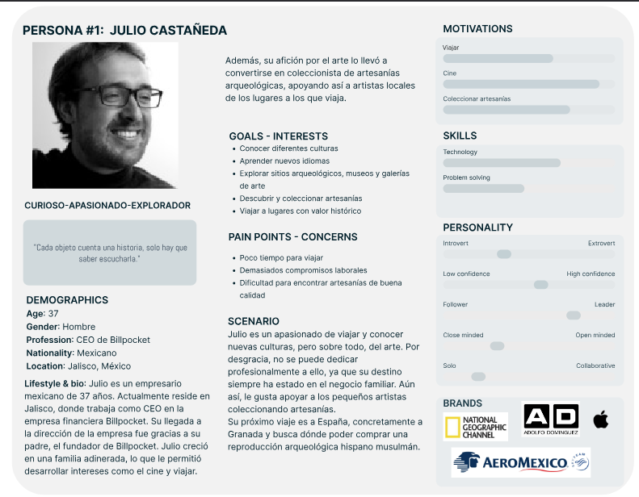

# DIU25
Prácticas Diseño Interfaces de Usuario (Tema: Reciclaje y artesanía (handcraft) ) 

[Guiones de prácticas](GuionesPracticas/)

Grupo: DIU3_CLAVE.  Curso: 2024/25 

Actualizado: 10/03/2025

Proyecto: 

>>> Decida el nombre corto de su propuesta en la práctica 2 

Descripción: 

>>> Describa la idea de su producto en la práctica 2 

Logotipo: 

>>> Si diseña un logotipo para su producto en la práctica 3 pongalo aqui, a un tamaño adecuado. Si diseña un slogan añadalo aquí

Miembros:
 * :bust_in_silhouette:  Clara Ruo García Segovia     :octocat:     
 * :bust_in_silhouette:  Eva Valcárcel López     :octocat:

>>> Los equipos son de 2 personas. Identifícaros con el nombre del Grupo y los enlaces a los perfiles de GitHub de cada integrante

----- 

>>> Este documento es el esqueleto del Case Study que explica el proceso de desarrollo de las 5 prácticas de DIU. Aparte de subir cada entrega a PRADO, se debe actualizar y dar formato de informe final a este documento online. Elimine este tipo de texto / comentarios desde la práctica 1 conforme proceda a cada paso

# Proceso de Diseño 

 

## Paso 1. UX User & Desk Research & Analisis 

### 1.a User Reseach Plan 
-----
El proyecto seleccionado para la investigación es la página web de “Kerarqueo Artesanía”, un centro artesanal de cerámica dedicado al Patrimonio y reproducciones arqueológicas. Aunque no contamos con experiencia previa en cerámica, estamos familiarizadas con el mundo de la artesanía a través de otras disciplinas como el crochet, lo que nos permite acercarnos al contexto desde una perspectiva de interés y valoración por las técnicas tradicionales.

El objetivo principal de la investigación es, a parte de mejorar la experiencia del usuario al utilizar la plataforma,  incrementar las ventas de productos e inscripciones a los cursos ofertados. Además, se busca aumentar la visibilidad de la marca y causar mayor impacto en un público más jóven, contribuyendo así en  la preservación de las tradiciones artesanales y arqueológicas. 

La estrategia que seguiremos estará basada en realizar análisis comparativos con plataformas similares, la creación de personas ficticias que nos ayuden a entender mejor al público objetivo, así como user journey maps que nos ayuden a mejorar la interacción con nuestra página. Finalmente, se realizará un usability review que identifique problemas de usabilidad.

### 1.b Competitive Analysis
-----
Para el análisis competitivo hemos elegido 2 páginas relacionadas también con la venta de artesanías:

* Pepa Moreno Cerámica: Taller de cerámica artesanal y sostenible en Baeza. Además, ofrecen talleres y cursos.
* Alfarería Núñez: Taller de cerámica artesanal realizada a mano y venta online. Además, cuenta con un blog muy interesante. 

Hemos elegido estas páginas porque ofrecen productos artesanales y servicios similares a Kerarqueo Granada. Cada una de ellas, presenta elmentos que se podrían haber aprovechado mejor en las demás. Por ejemplo, el blog de Alfarería Núñez destaca sobre los de Pepa Moreno o Kerarkeo; mientras que la estética de Pepa Moreno resulta más atractiva que la de las otras dos.
Por ello, hemos pensado que realizar una comparativa con estas 2 páginas podría aportar información relevante a nuestra investigación.

Para comparar las 3 páginas hemos valorado de 0 a 3 estrellas los siguientes criterios:
* Actualizaciones frecuentes: comprobar si la página está actualizada en cuanto a los talleres que ofertan como en las publicaciones de los blogs.
* Estrategia de expansión: hemos valorado que a parte de vender artesanías, también ofrezcan cursos y tengan un blog atractivo.
* Estrategia de marketing: si tienen enlaces visibles a sus redes sociales y que funcionen correctamente
* Rendimiento de la web: hemos valorado que tarde poco en cargar las páginas
* Seguridad y protección de datos: que dispongan de aviso legal, política de privacidad y pago seguro; y que sean visibles.
* Soporte multilingüe: si se puede cambiar el idioma de la página
* Opciones de filtrado y búsqueda: si se pueden filtrar los artículos según la categoría, precio, más recientes… o directamente hacer una búsqueda concreta.
* Contacto: si hay información de contacto visible como el teléfono, correo electrónico o incluso un formulario para enviar un mensaje. También hemos valorado que tenga mapa útil.
* Cuenta de usuario: hemos valorado si hay opción de que los usuarios se creen una cuenta y la facilidad para hacerlo.
* Diseño intuitivo: si la página es fácil de usar, si está bien estructurada y los botones clicables son distinguibles.
* Retroalimentación: hemos valorado que la página ofrezca mensajes de confirmación, ya sea cuando se incluye un producto en el carrito o al realizar un pago, además de si hay opción de valoraciones para los usuarios.
* Inscripción a cursos: si ofrecen cursos activos y hay facilidades en la página para apuntarse.

Enlace al pdf: [Competitor Analysis](./P1/2.%20Competitor_Analysis/Competitor%20Analysis%20[DIU23]%20(Copy).pdf)

### 1.c Personas
Para esta práctica hemos elegidos dos perfiles de personas diferentes y con distintos objetivos. Por un lado, nos encontramos con Julio, un hombre mexicano de mediana edad que quiere comprar una artesanía arqueológica para añdir a su colección. Por otro lado, Raquel es una estudiante de medicina que busca apuntarse a clases de cerámica para desconectar del estrés de la universidad.

 

### 1.d User Journey Map
 

>>> Describe el porqué de las dos experiencias de usuario contadas en el journey map. Por ejemplo, reflexiona si te parece que son habituales. Enlaza con los recursos journey que están en la carpeta P1/. Borra esta linea del template cuando termines.  

### 1.e Usability Review
 
----

>>>  El objetivo es revisar la usabilidad del competidor seleccionado. Usamos un checklist de verificación. Tras usarlo, subelo a la carpeta P1/ Ofrece aquí un parrafo para:
>>> - Enlace al documento:  (xls/pdf) 
>>> - URL y Valoración numérica obtenida: 
>>> - Comentario sobre la revisión:  (puntos fuertes y débiles detectados)

 

## Paso 2. UX Design  

>>> Cualquier título puede ser adaptado. Recuerda borrar estos comentarios del template en tu documento

### 2.a Reframing / IDEACION: Feedback Capture Grid / EMpathy map 
 
----

>>> Comenta con un diagrama los aspectos más destacados a modo de conclusion de la práctica anterior. De qué carece la competencia?? Tu diagrama puede ser una figura subida a la carpeta P2/

 Interesante | Críticas     
| ------------- | -------
  Preguntas | Nuevas ideas
  
    
>>> Explica el Problema y plantea una hipótesis. Es decir, explica aquí qué 
>>> se plantea como "propuesta de valor" para un nuevo diseño de aplicación propio

### 2.b ScopeCanvas

----

>>> Propuesta de valor, pero ahora en vez de un texto es un ScopeCanvas que has subido a P2/ y enlazado desde aqui. Tambien vale una imagen miniatura del recurso.
>>> No olvides que tu propuesta ya tiene un nombre corto y puedes actualizar la cabecera de este archivo

### 2.b User Flow (task) analysis 
 
-----

>>> Definir "User Map" y "Task Flow" ... enlazar desde P2/ y describir brevemente

### 2.c IA: Sitemap + Labelling 
 
----

>>> Identificar términos para diálogo con usuario (evita el spanglish) y la arquitectura de la información. Es muy apropiado un diagrama tipo sitemap y una tabla que se ampliaría para llevar asociado la columna iconos (tanto para la web como para una app). 

Término | Significado     
| ------------- | -------
  Login  | acceder a plataforma

### 2.d Wireframes
 
-----

>>> Plantear el diseño del layout para Web/movil (organización y simulación). Describa la herramienta usada 

 

## Paso 3. Mi UX-Case Study (diseño)

>>> Cualquier título puede ser adaptado. Recuerda borrar estos comentarios del template en tu documento

### 3.a Moodboard

-----

>>> Diseño visual con una guía de estilos visual (moodboard) 
>>> Incluir Logotipo. Todos los recursos estarán subidos a la carpeta P3/
>>> Explique aqui la/s herramienta/s utilizada/s y el por qué de la resolución empleada. Reflexione ¿Se puede usar esta imagen como cabecera de Instagram, por ejemplo, o se necesitan otras?

### 3.b Landing Page
 
----

>>> Plantear el Landing Page del producto. Aplica estilos definidos en el moodboard

### 3.c Guidelines
 
----

>>> Estudio de Guidelines y explicación de los Patrones IU a usar 
>>> Es decir, tras documentarse, muestre las deciones tomadas sobre Patrones IU a usar para la fase siguiente de prototipado. 

### 3.d Mockup
 
----

>>> Consiste en tener un Layout en acción. Un Mockup es un prototipo HTML que permite simular tareas con estilo de IU seleccionado. Muy útil para compartir con stakeholders

### 3.e ¿My UX-Case Study?
 
-----

>>> Publicar my Case Study en Github... Es el momento de dejar este documento para que sea evaluado y calificado como parte de la práctica
>>> Documente bien la cabecera y asegurese que ha resumido los pasos realizados para el diseño de su producto

 

## Paso 4. Pruebas de Evaluación 

### 4.a Reclutamiento de usuarios 

-----

>>> Breve descripción del caso asignado (llamado Caso-B) con enlace al repositorio Github
>>> Tabla y asignación de personas ficticias (o reales) a las pruebas. Exprese las ideas de posibles situaciones conflictivas de esa persona en las propuestas evaluadas. Mínimo 4 usuarios: asigne 2 al Caso A y 2 al caso B.

| Usuarios | Sexo/Edad     | Ocupación   |  Exp.TIC    | Personalidad | Plataforma | Caso
| ------------- | -------- | ----------- | ----------- | -----------  | ---------- | ----
| User1's name  | H / 18   | Estudiante  | Media       | Introvertido | Web.       | A 
| User2's name  | H / 18   | Estudiante  | Media       | Timido       | Web        | A 
| User3's name  | M / 35   | Abogado     | Baja        | Emocional    | móvil      | B 
| User4's name  | H / 18   | Estudiante  | Media       | Racional     | Web        | B 

### 4.b Diseño de las pruebas 
 
-----

>>> Planifique qué pruebas se van a desarrollar. ¿En qué consisten? ¿Se hará uso del checklist de la P1?

### 4.c Cuestionario SUS
 
----

>>> Como uno de los test para la prueba A/B testing, usaremos el **Cuestionario SUS** que permite valorar la satisfacción de cada usuario con el diseño utilizado (casos A o B). Para calcular la valoración numérica y la etiqueta linguistica resultante usamos la [hoja de cálculo](https://github.com/mgea/DIU19/blob/master/Cuestionario%20SUS%20DIU.xlsx). Previamente conozca en qué consiste la escala SUS y cómo se interpretan sus resultados
http://usabilitygeek.com/how-to-use-the-system-usability-scale-sus-to-evaluate-the-usability-of-your-website/)
Para más información, consultar aquí sobre la [metodología SUS](https://cui.unige.ch/isi/icle-wiki/_media/ipm:test-suschapt.pdf)
>>> Adjuntar en la carpeta P4/ el excel resultante y describa aquí la valoración personal de los resultados 

### 4.d A/B Testing
 
-----

>>> Los resultados de un A/B testing con 3 pruebas y 2 casos o alternativas daría como resultado una tabla de 3 filas y 2 columnas, además de un resultado agregado global. Especifique con claridad el resultado: qué caso es más usable, A o B?

### 4.e Aplicación del método Eye Tracking 

----

>>> Indica cómo se diseña el experimento y se reclutan los usuarios. Explica la herramienta / uso de gazerecorder.com u otra similar. Aplíquese únicamente al caso B.

  
>>> Cambiar esta img por una de vuestro experimento. El recurso deberá estar subido a la carpeta P4/  

>>> gazerecorder en versión de pruebas puede estar limitada a 3 usuarios para generar mapa de calor (crédito > 0 para que funcione) 

### 4.f Usability Report de B
 
-----

>>> Añadir report de usabilidad para práctica B (la de los compañeros) aportando resultados y valoración de cada debilidad de usabilidad. 
>>> Enlazar aqui con el archivo subido a P4/ que indica qué equipo evalua a qué otro equipo.

>>> Complementad el Case Study en su Paso 4 con una Valoración personal del equipo sobre esta tarea

 

## Paso 5. Exportación y Documentación 

### 5.a Exportación a HTML/React
 
----

>>> Breve descripción de esta tarea. Las evidencias de este paso quedan subidas a P5/

### 5.b Documentación con Storybook

----

>>> Breve descripción de esta tarea. Las evidencias de este paso quedan subidas a P5/

 

## Conclusiones finales & Valoración de las prácticas

>>> Opinión FINAL del proceso de desarrollo de diseño siguiendo metodología UX y valoración (positiva /negativa) de los resultados obtenidos. ¿Qué se puede mejorar? Recuerda que este tipo de texto se debe eliminar del template que se os proporciona 

